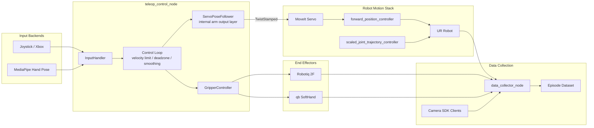

## teleop-ur

面向 Universal Robots 多种机械臂型号的遥操作与数据采集系统，支持多输入控制、多末端执行器和多机器人控制器切换。

这个项目的核心不是单一 demo，而是一套可切换、可扩展的控制系统：

- 多输入控制器：`joy` / `mediapipe`
- 多末端执行器：`robotiq` / `qbsofthand`
- 多机器人控制器协同：`forward_position_controller` / `scaled_joint_trajectory_controller`
- 数据采集：`data_collector_node`

当前默认模式：

- 输入：`joy`
- 夹爪：`robotiq`
- 机械臂输出：MoveIt Servo `TwistStamped`

## Overview

系统主入口：`src/teleop_control_py/launch/control_system.launch.py`

主链路是一个分层控制系统：输入策略负责把设备信号转成统一控制语义，`teleop_control_node` 负责调度，内部输出层负责控制器切换和 Servo 启动，最终由 UR 控制器执行。

### Capability Matrix

| 维度 | 当前支持 | 说明 |
| --- | --- | --- |
| 输入后端 | `joy`, `mediapipe` | 通过 `input_type` 切换 |
| 末端执行器 | `robotiq`, `qbsofthand` | 通过 `gripper_type` 切换 |
| 机器人输出 | MoveIt Servo `TwistStamped` | 输出到 `/servo_node/delta_twist_cmds` |
| 控制器协同 | `forward_position_controller`, `scaled_joint_trajectory_controller` | 支持 Teleop / 轨迹控制器分工 |
| 数据采集 | 全局相机、腕部相机、机器人状态、夹爪状态 | `data_collector_node` 负责统一采集 |
| 安全保护 | 输入看门狗、速度/加速度限幅 | 防止输入断连与主机卡顿带来的残留运动 |

## System Architecture



架构上有两个关键点：

- `teleop_control_node` 是主控节点，输入解析、速度限制、夹爪控制和机械臂输出都在这里统一调度。
- `ServoPoseFollower` 在当前主路径中是内部输出层，不必单独启动；独立 `servo_pose_follower` 更适合调试或单独验证 Twist 转发链路。

### Backend Comparison

| 类别 | 选项 | 接口形态 | 适用场景 | 当前状态 |
| --- | --- | --- | --- | --- |
| 输入后端 | `joy` | `/joy` | 低延迟人工遥操作 | 默认方案 |
| 输入后端 | `mediapipe` | 图像话题输入 | 手势驱动实验 | teleop 节点内置 MediaPipe 手势识别 |
| 末端执行器 | `robotiq` | `Float32MultiArray` 话题 | 二指夹爪采集/抓取 | 已按当前驱动接口对齐 |
| 末端执行器 | `qbsofthand` | `SetClosure` 服务优先 | 柔性手抓取 | 已接入统一接口 |
| 机器人控制器 | `forward_position_controller` | Servo Teleop 输出 | 实时遥操作 | Teleop 主控制器 |
| 机器人控制器 | `scaled_joint_trajectory_controller` | 轨迹执行 | 回零、规划轨迹 | 与采集流程配合 |

## Repository Layout

- 主启动：`src/teleop_control_py/launch/control_system.launch.py`
- 仅 teleop 启动：`src/teleop_control_py/launch/teleop_control.launch.py`
- 遥操作配置：`src/teleop_control_py/config/teleop_params.yaml`
- 数据采集配置：`src/teleop_control_py/config/data_collector_params.yaml`
- 手柄驱动配置：`src/multi_joy_driver/config/joy_driver_params.yaml`

## Getting Started

### 1. Build

```bash
python -m colcon build --packages-select teleop_control_py
source install/setup.bash
```

### 2. Start The Full System

```bash
ros2 launch teleop_control_py control_system.launch.py
```

这个 launch 会按配置自动组合：

- UR 驱动
- MoveIt / Servo
- 手柄驱动或 RealSense
- Robotiq 或 qbSoftHand 驱动
- `teleop_control_node`

支持的 UR 机型由 `ur_type` 参数决定，GUI 中可手动输入，默认值为 `ur5`。常见可用值取决于当前 UR 驱动版本，通常包括 `ur3`、`ur5`、`ur10`、`ur16e`、`ur20`、`ur30` 以及对应的 e 系列型号。

### 3. Start The GUI

推荐在完成编译并 `source install/setup.bash` 后，通过包入口启动 GUI：

```bash
ros2 run teleop_control_py teleop_gui
```

如果你正在源码态调试，也可以继续使用薄入口脚本：

```bash
python3 scripts/teleop_gui.py
```

GUI 当前支持：

- 启动 / 停止相机 ROS2 驱动
- 启动 / 停止机械臂 ROS2 驱动
- 启动整套 teleop 系统
- 显示模块状态与硬件占用情况
- 启动数据采集、录制、回 Home、设置当前 Home
- 手动输入 `ur_type`，并在启动机械臂驱动或遥操作系统时自动覆盖 launch 参数

### 4. Common Launch Variants

手柄 + Robotiq：

```bash
ros2 launch teleop_control_py control_system.launch.py \
    input_type:=joy \
    gripper_type:=robotiq \
    robotiq_serial_port:=/dev/robotiq_gripper
```

手柄 + qbSoftHand：

```bash
ros2 launch teleop_control_py control_system.launch.py \
    input_type:=joy \
    gripper_type:=qbsofthand
```

MediaPipe + Robotiq：

```bash
ros2 launch teleop_control_py control_system.launch.py \
    input_type:=mediapipe \
    gripper_type:=robotiq
```

说明：`input_type:=mediapipe` 时，当前 teleop 节点会直接订阅图像输入话题，并在节点内部完成 MediaPipe 手部识别。

整套系统 + 数据采集：

```bash
ros2 launch teleop_control_py control_system.launch.py \
    input_type:=joy \
    gripper_type:=robotiq \
    enable_data_collector:=true
```

如需覆盖采集配置文件：

```bash
ros2 launch teleop_control_py control_system.launch.py \
    enable_data_collector:=true \
    data_collector_params_file:=/absolute/path/to/data_collector_params.yaml
```

### 5. Start Teleop Only

如果 UR、MoveIt、夹爪驱动都已单独启动：

```bash
ros2 launch teleop_control_py teleop_control.launch.py
```

## Control Backends

### Input Controllers

- `joy`: 面向 Xbox / 通用手柄输入
- `mediapipe`: 面向图像输入的内置手势识别

当前默认 Xbox 映射：

- 左摇杆：平移
- 右摇杆：旋转
- `A / B`：Z 方向
- `X / Y`：绕 Z 轴
- `LB / RB`：夹爪开合

当前实现已经修正：

- 松手后对应轴直接回零
- 手柄与夹爪命令链路已和当前驱动对齐
- 输入订阅使用 `SensorData QoS`，优先消费最新一帧输入而不是堆积旧消息
- 默认启用输入看门狗：`input_watchdog_timeout_sec=0.2`，超过超时未收到新输入时强制输出零命令

### End Effectors

Robotiq 默认使用：

- `robotiq_command_interface: confidence_topic`
- 话题：`/robotiq_2f_gripper/confidence_command`

语义：

- 正数打开
- 负数闭合

qbSoftHand 默认优先使用服务：

- `/qbsofthand_control_node/set_closure`

### Robot Controllers

当前系统支持在以下机器人控制器之间协同工作：

- `forward_position_controller`: 遥操作 / Servo 输出控制器
- `scaled_joint_trajectory_controller`: 轨迹执行与 `go_home` 控制器

`teleop_control_node` 与 `data_collector_node` 都已经按当前配置支持控制器切换相关参数。

### Launch Behavior

当前总启动文件会按参数自动组合系统组件：

| 条件 | 行为 |
| --- | --- |
| `input_type=joy` | 启动 `multi_joy_driver` |
| `input_type=mediapipe` 且 `enable_camera=true` | 启动 RealSense 链路 |
| `enable_moveit=true` | 启动 MoveIt / Servo |
| `gripper_type=robotiq` | 启动 Robotiq 驱动 |
| `gripper_type=qbsofthand` | 启动 qbSoftHand 驱动 |
| `enable_data_collector=true` | 启动 `data_collector_node`，并按 `gripper_type` 自动映射采集端 `end_effector_type` |

## Data Collection

启动：

```bash
ros2 run teleop_control_py data_collector_node \
    --ros-args \
    --params-file src/teleop_control_py/config/data_collector_params.yaml
```

控制服务：

```bash
ros2 service call /data_collector/start std_srvs/srv/Trigger {}
ros2 service call /data_collector/stop std_srvs/srv/Trigger {}
ros2 service call /data_collector/go_home std_srvs/srv/Trigger {}
```

当前 `data_collector_node`：

- 直接通过 SDK 拉取相机图像
- 不依赖 ROS 图像话题采样
- 通过 ROS 订阅读取关节、TCP 位姿、夹爪状态
- 订阅侧统一使用 `SensorData QoS`
- 数据集 `action` 记录的是执行后的机器人状态 `[xyz, rotvec, gripper]`，由共享数学函数组装，不是原始手柄输入

## Configuration

常改文件：`src/teleop_control_py/config/teleop_params.yaml`

- `input_type`: `joy | mediapipe`
- `gripper_type`: `robotiq | qbsofthand`
- `joy_deadzone`
- `joy_curve`
- `input_watchdog_timeout_sec`
- `max_linear_vel`
- `max_angular_vel`
- `max_linear_accel`
- `max_angular_accel`
- `teleop_controller`
- `trajectory_controller`

常改文件：`src/teleop_control_py/config/data_collector_params.yaml`

- `output_path`
- `global_camera_source`
- `wrist_camera_source`
- `end_effector_type`
- `home_joint_positions`

## Dependencies

至少需要：

- UR 驱动
- MoveIt Servo
- RealSense 相关依赖
- OAK-D / DepthAI 相关依赖
- Robotiq 或 qbSoftHand 驱动

Python 依赖：

```bash
pip install -r requirements.txt
```


